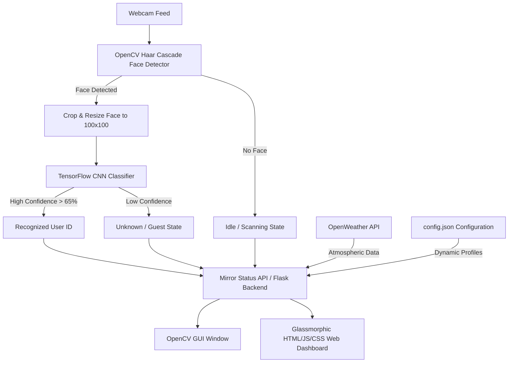

# Smart Mirror with Face-Based Health Alerts

An elegant, digital Smart Mirror system that leverages deep learning to recognize users in real-time, displaying custom greetings, real-time localized weather statistics, and personalized health recommendations/alerts. The project offers both a classic local OpenCV graphical window and a premium, responsive glassmorphic Web Dashboard interface.

---

## 🌟 Features

*   **Real-time Face Detection & Recognition**: Integrated OpenCV Haar Cascades for accurate real-time face tracking and a Convolutional Neural Network (CNN) trained with TensorFlow/Keras to classify users.
*   **Preprocessing Consistency**: Intelligent face cropping & resizing during image capture and inference ensures model accuracy independent of background scenes.
*   **Dual Display Interfaces**:
    *   **Classic Desktop GUI**: Local OpenCV window with horizontal flip (mirror mode) and high-contrast, semi-transparent data panels.
    *   **Premium Web Dashboard**: A glassmorphic web dashboard (Flask + HTML5/CSS3/Vanilla JS) featuring frosted glass blur effects, smooth micro-animations, pulsing indicator statuses, and collapsible widgets.
*   **Live Weather Integration**: Automatic tracking of temperature and humidity using the OpenWeather API, with sliding buffer smoothing to reduce telemetry noise.
*   **Dynamic Customization**: Interactive configuration manager inside the web browser to add new profiles or edit personalized greetings and health alerts on the fly without restarting the server.
*   **Self-Healing Classification**: Automatically creates an `Unknown` class populated with randomized noise images if only a single user profile exists, ensuring binary classification compile compatibility inside TensorFlow.

---

## 📐 System Architecture



---

## 📂 Directory Structure

```text
├── dataset/                    # Face capture training data (folders per person)
│   ├── Unknown/                # Automatically generated noise/dark backgrounds
│   └── [username]/             # 200 color face crops captured per user
├── model/
│   └── face_model.h5           # Trained ConvNet model weights
├── templates/
│   └── index.html              # HTML layout for Web Dashboard
├── static/
│   ├── style.css               # Modern glassmorphism CSS
│   └── app.js                  # Frontend ticker, polling client & config CRUD
├── capture_images.py           # Command-line utility to record user face datasets
├── train_model.py              # Script to build and train the TensorFlow CNN model
├── smart_mirror.py             # Desktop OpenCV-based Smart Mirror application
├── app.py                      # Flask web server and backend APIs
├── config.json                 # JSON file mapping profiles to alerts & greetings
└── README.md                   # Setup and operations guide (This file)
```

---

## 🛠️ Prerequisites & Installation

The project runs on **Python 3.8 - 3.11** (tested on Python 3.10).

1.  **Clone or navigate** to the project workspace:
    ```bash
    cd "c:\doc_imp\dnn project"
    ```

2.  **Install Required Dependencies**:
    ```bash
    pip install tensorflow==2.10.0 opencv-python pillow flask flask-cors requests scikit-learn numpy==1.24.4 "protobuf<3.20"
    ```
    *Note: If you run into protobuf descriptor errors with TensorFlow, the library uses protobuf `< 3.20` which will be handled automatically by running the above command.*

---

## 🚀 How to Run

### Step 1: Capture Face Dataset
Run the capturing utility to record face crops for training. Enter your name when prompted:
```bash
python capture_images.py
```
*   The camera window will open. Look directly at the camera.
*   The script uses a Haar Cascade to crop only your face and will collect **200 images**.
*   Images are saved inside `dataset/[your_name]/`.
*   Press `q` if you want to abort the capture.

### Step 2: Train the CNN Model
Train the Convolutional Neural Network on the captured dataset:
```bash
python train_model.py
```
*   The script reads images from all subfolders in `dataset/`.
*   If only one person is detected (e.g. `vignesh`), it automatically generates an `Unknown` noise dataset so that a binary classifier can compile.
*   It splits data, trains a sequential CNN over 20 epochs, and writes the weights to `model/face_model.h5`.

### Step 3: Run the Smart Mirror

You can run the smart mirror in two formats:

#### Option A: Flask Web Dashboard (Recommended - Premium)
Run the web backend:
```bash
python app.py
```
*   Open your web browser and navigate to: **`http://localhost:5000`**
*   You will see the premium glassmorphic mirror interface with active weather metrics, real-time clock, greeting cards, and animated health alerts.
*   Click **Smart Mirror Settings** at the bottom to edit greetings/health alerts or add new profiles.
*   Click **Hide Feed** to make the mirror view transparent, mimicking a physical reflective mirror display.

#### Option B: Classic Desktop OpenCV GUI
Run the native desktop executable script:
```bash
python smart_mirror.py
```
*   A window titled "Smart Mirror - Face Based Health Alerts" will open.
*   It flips the camera feed for mirror orientation, prints text over a translucent card overlay, and runs face recognition.
*   Press `q` in the OpenCV window to exit.

---

## ⚙️ Configuration File (`config.json`)

The custom alerts are stored in `config.json` in the root folder. You can configure them manually or through the Web Dashboard UI:
```json
{
  "vignesh": {
    "greeting": "Hello Vignesh!",
    "alert": "Stay Hydrated! Drink at least 8 glasses of water today."
  },
  "Unknown": {
    "greeting": "Welcome to Smart Mirror!",
    "alert": "Keep smiling and stay healthy today!"
  },
  "default": {
    "greeting": "Welcome!",
    "alert": "Stay healthy, positive, and active!"
  }
}
```

---

## 🔧 Troubleshooting

*   **Camera index error**: If the camera does not start or returns `None`, change `cv2.VideoCapture(0)` to `cv2.VideoCapture(1)` or `2` in `capture_images.py`, `smart_mirror.py`, and `app.py` depending on your external webcam index.
*   **TensorFlow Protobuf Conflicts**: If python crashes during `import tensorflow` with a `TypeError: Descriptors cannot be created directly...` error, run:
    ```bash
    pip install "protobuf<3.20"
    ```
    or set the environment variable:
    ```cmd
    set PROTOCOL_BUFFERS_PYTHON_IMPLEMENTATION=python
    ```
*   **OpenWeather API Limits**: The default API key in the scripts is shared. If you receive "N/A" for weather, you can sign up for a free key at [OpenWeatherMap](https://openweathermap.org/) and replace the `API_KEY` string variable in `smart_mirror.py` and `app.py`.
